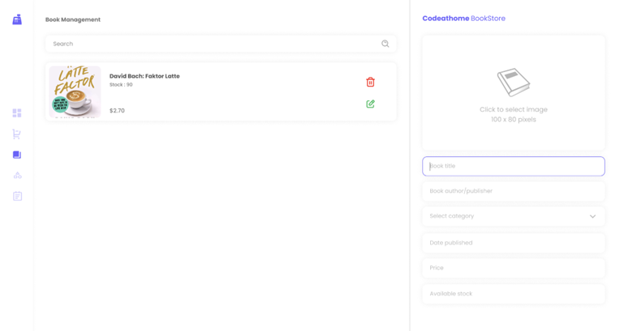
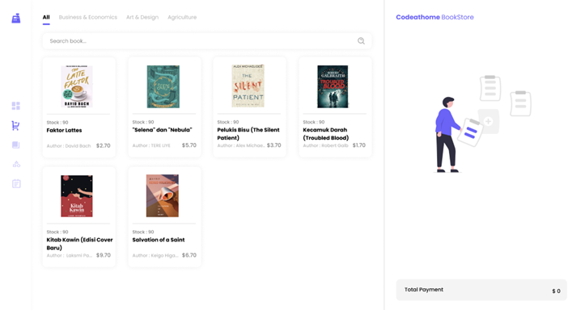
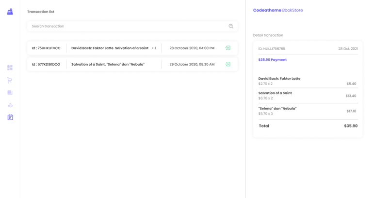

Toko Buku

Pak Sofa baru membuka toko penjualan buku akan tetapi toko buku pak Sofa belum ada sistem untuk pencatatan penjualan dengan baik. Stok buku sering tidak sesuai dengan yang di toko dan history penjualan masih menggunakan pencatatan manual hingga sulit untuk di tracking history penjual.

Karena bingung akhirnya Pak Sofa ingin melihat sistem penjualan yang dimiliki oleh temannya.

1.1 Management Book

1.2 Checkout

1.3 Transaction List

Beberapa ketentuan yang ingin diterapkan Oleh Pak Sofa dalam Membuat Sistemnya

Task 1: Manajemen kategori
●	Manajemen kategori harus dapat CRUD create, read, update dan delete

Task 2: Manajemen buku
●	Manajemen buku harus dapat CRUD create, read, update dan delete
●	Wajib dapat mencari buku berdasarkan judul

Task 3: Checkout
●	Menampilkan data buku dan dapat mencari berdasarkan buku dan kategori
●	Setiap pembelian buku harus mengecek stok buku
●	Wajib menyimpan data pembelian buku (judul, cover, price dan quantity)
●	Setiap kali melakukan pembelian buku wajib mengurangi stok dari buku

Task 4: Transaksi
●	Menampilkan semua data transaksi
●	Menampilkan detail transaksi
●	Dapat melakukan pencarian berdasarkan invoice